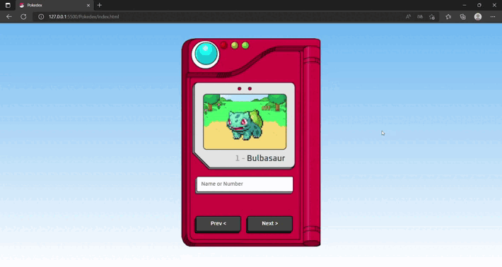

<h1 align="center">Pokedex</h1>

## ✨ Tecnologias

Esse projeto foi desenvolvido com as seguintes tecnologias:

- [HTML](https://www.w3schools.com/html/)
- [CSS](https://www.w3schools.com/css/)
- [JavaScript](https://www.w3schools.com/js/)
- [PokeAPI](https://pokeapi.co)

## 💻 Projeto

Esse é um projeto criado para ilustrar uma Pokedex, onde podemos consultar diversos Pokemons diferentes. Pelo seu nome ou pelo seu identifcador único, no centro da pokedex irá conter um gif do Pokemon enconrado. Segue vídeo de apresentação abaixo.

## 🚀 O projeto

  

## 📧 Contatos

  
  

---
Deixo aqui os créditos ao canal Manual do Dev por ensinar a como criar esse projeto.
